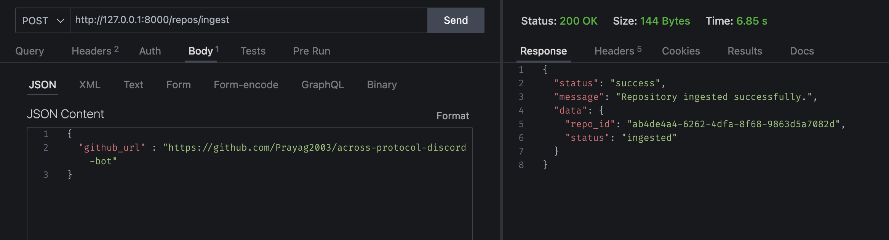
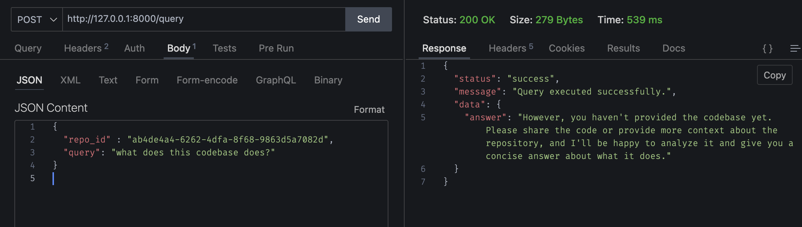

# Githubify-v1

A tool to analyze GitHub repositories.

## 🛠 Install Poetry

[Poetry](https://python-poetry.org/) is a dependency management and packaging tool for Python.

### macOS/Linux

```bash
curl -sSL https://install.python-poetry.org | python3 -
```

Verify installation:

```bash
poetry --version
```

Add Poetry to your PATH:

### macOS/Linux

```bash
export PATH="/Users/$USER/.local/bin:$PATH"
```

## Setup Instructions

1. Clone the repository:

```bash
git clone https://www.github.com/Prayag2003/githubify-v1
```

2. Navigate to project directory:

```bash
cd githubify-v1/server
```

3. Install dependencies using Poetry:

```bash
poetry install
```

4. Start the development server:

```bash
poetry run uvicorn app.main:app --reload
```

## API Usage

To analyze a GitHub repository, send a POST request to `/repos/ingest` endpoint:


```bash
curl -X POST \
    http://localhost:8000/repos/ingest \
    -H 'Content-Type: application/json' \
    -d '{
  "github_url" : "https://github.com/Prayag2003/across-protocol-discord-bot"
}'
```

---

To chat with a GitHub repository, send a POST request to `/query` endpoint:



```bash
curl -X POST \
    http://localhost:8000/query \
    -H 'Content-Type: application/json' \
    -d '{
  "repo_id": "ab4de4a4-6262-4dfa-8f68-9863d5a7082d",
  "query": "what does this codebase does?"
}'
```

The server will run on `http://localhost:8000` by default.

### Prerequisites

- Python 3.7+
- Poetry package manager
