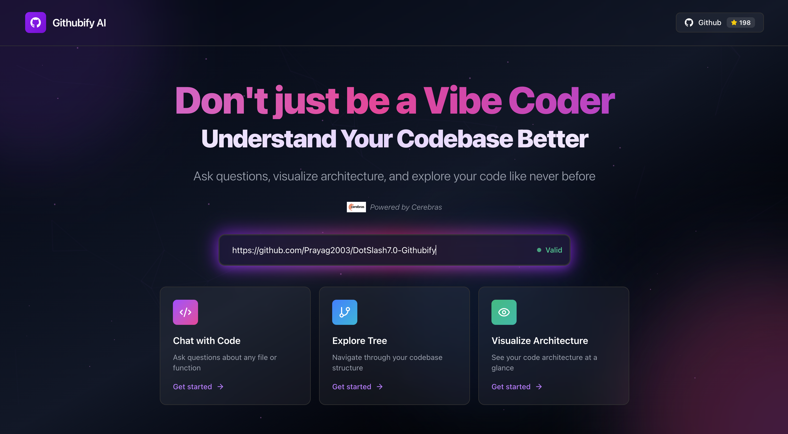
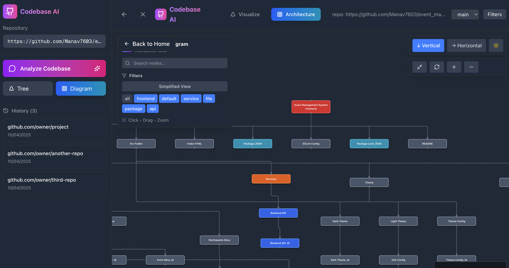

# Githubify - Codebase Comprehension Platform and Onboarding SAAS

## 👥 Team

### Ethereum Bots Team

[](https://youtu.be/ZbVsCiwMjb8)

This project was developed by:

- **Manav Pandya** - Core Architecture & Backend Development
- **Tushar Jain** - AI Integration & Query Engine
- **Prayag Bhatt** - API Development & Infrastructure

## 📋 Table of Contents

- [Overview](#overview)
- [Architecture](#architecture)
- [Problem Statement](#problem-statement)
- [Solution](#solution)
- [Features](#features)
- [Getting Started](#getting-started)
- [API Documentation](#Api-documentation)
- [Technology Stack](#technology-stack)

---

## 🎯 Overview <a id="overview"></a>

**Githubify** is an intelligent codebase comprehension platform designed to accelerate developer onboarding and reduce the learning curve for new team members, interns, and open-source contributors. By leveraging AI-powered analysis, Githubify transforms complex repositories into understandable, queryable knowledge bases.

<p align="center">
  
</p>

## Chat with your Codebase

<p align="center">
  
</p>

<p align="center">
  
</p>

## Visualise your Codebase:

<p align="center">
  
</p>

## Codebase as a Tree

<p align="center">
  
</p>

---

## 🏗 Architecture <a id="architecture"></a>

<p align="center">
  
</p>

## 🚨 Problem Statement <a id="problem-statement"></a>

Organizations face significant challenges when onboarding new developers:

- **Time-Intensive Onboarding**: New developers spend weeks understanding codebases, consuming valuable senior developer time
- **Knowledge Bottleneck**: Limited availability of senior developers to guide newcomers through complex architectures
- **Context Loss**: Documentation often becomes outdated, making it difficult to understand design decisions and code relationships
- **Steep Learning Curve**: Large repositories with multiple modules and dependencies are overwhelming for newcomers
- **Reduced Productivity**: Delayed understanding leads to slower contribution cycles and increased frustration
- **The Cost**: Companies lose an average of 30-50 hours of senior developer time per new hire during onboarding, while new developers take 3-6 months to become fully productive.

## ✨ Features <a id="features"></a>

### Core Capabilities

- **Intelligent Repository Analysis**: Automatically ingests and analyzes GitHub repositories to build a comprehensive knowledge graph
- **Natural Language Queries**: Ask questions in plain English about code functionality, architecture, and implementation
- **Fast Onboarding**: Reduce onboarding time from weeks to days
- **Repository Insights**: Understand codebase structure, patterns, and best practices

### Benefits

- **For Senior Developers**: Reduced time spent on repetitive onboarding explanations
- **For Teams & New Developers**: Faster time-to-productivity and more consistent knowledge sharing
- **For Open Source Projects**: Lower barrier to entry for new contributors

---

### Key Components

1. **Ingestion Service**: Clones and analyzes repositories, extracting code structure and relationships
2. **Knowledge Base**: Stores processed repository information in a queryable format
3. **Query Engine**: Processes natural language queries and retrieves relevant information
4. **API Layer**: FastAPI-based REST interface for client interactions

---

## 🚀 Getting Started <a id="getting-started"></a>

### Prerequisites

Ensure you have the following installed:

- **Python**: Version 3.7 or higher
- **UV Package Manager**: For dependency management

### Installation

#### Step 1: Install UV Package Manager

If you don't have UV installed, install it first:

```bash
# On macOS/Linux
curl -LsSf https://astral.sh/uv/install.sh | sh

# On Windows
powershell -c "irm https://astral.sh/uv/install.ps1 | iex"
```

#### Step 2: Clone the Repository

```bash
git clone https://github.com/Prayag2003/githubify-ethereum-bots-futurestack-hack
cd githubify-ethereum-bots-futurestack-hack/server
```

#### Step 3: Create Virtual Environment and Install Dependencies

```bash
# Create virtual environment
uv venv

# Activate virtual environment
# On macOS/Linux:
source .venv/bin/activate

# On Windows:
.venv\Scripts\activate

# Install dependencies
uv pip install -r requirements.txt
```

#### Step 4: Configure Environment Variables

Create a `.env` file in the server directory:

```bash
CEREBRAS_API_KEY=""
PINECONE_API_KEY=""
```

#### Step 5: Start the Development Server

```bash
uvicorn app.main:app --reload
```

The server will start on `http://localhost:8000`. You can access the interactive API documentation at `http://localhost:8000/docs`.

---

## 📚 API Documentation

### Base URL

```
http://localhost:8000
```

### Endpoints

#### 1. Repository Ingestion

Analyze and ingest a GitHub repository into the knowledge base.

**Endpoint**: `POST /repos/ingest`

**Request Body**:

```json
{
	"github_url": "https://github.com/username/repository-name"
}
```

**Response**:

```json
{
	"repo_id": "ab4de4a4-6262-4dfa-8f68-9863d5a7082d",
	"status": "success",
	"message": "Repository ingested successfully",
	"files_processed": 42,
	"analysis_time": "15.3s"
}
```

**Status Codes**:

- `200 OK`: Repository ingested successfully
- `400 Bad Request`: Invalid GitHub URL
- `404 Not Found`: Repository not found
- `500 Internal Server Error`: Processing error

#### 2. Query Repository

Ask questions about an ingested repository.

**Endpoint**: `POST /query`

**Request Body**:

```json
{
	"repo_id": "ab4de4a4-6262-4dfa-8f68-9863d5a7082d",
	"query": "What does this codebase do?"
}
```

**Response**:

```json
{
	"answer": "This codebase implements a Discord bot for the Across Protocol...",
	"relevant_files": [
		"src/bot/main.py",
		"src/handlers/message_handler.py"
	],
	"confidence": 0.95,
	"timestamp": "2025-10-04T10:30:00Z"
}
```

**Status Codes**:

- `200 OK`: Query processed successfully
- `400 Bad Request`: Invalid request format
- `404 Not Found`: Repository ID not found
- `500 Internal Server Error`: Query processing error

#### 3. List Repositories

Get all ingested repositories.

**Endpoint**: `GET /repos`

**Response**:

```json
{
	"repositories": [
		{
			"repo_id": "ab4de4a4-6262-4dfa-8f68-9863d5a7082d",
			"name": "across-protocol-discord-bot",
			"url": "https://github.com/Prayag2003/across-protocol-discord-bot",
			"ingested_at": "2025-10-04T09:15:00Z",
			"files_count": 42
		}
	]
}
```

---

## 💻 Usage Examples

### Example 1: Ingesting a Repository

```bash
curl -X POST \
  http://localhost:8000/repos/ingest \
  -H 'Content-Type: application/json' \
  -d '{
    "github_url": "https://github.com/Prayag2003/across-protocol-discord-bot"
  }'
```

### Example 2: Querying About Architecture

```bash
curl -X POST \
  http://localhost:8000/query \
  -H 'Content-Type: application/json' \
  -d '{
    "repo_id": "ab4de4a4-6262-4dfa-8f68-9863d5a7082d",
    "query": "Explain the main architecture of this application"
  }'
```

### Example 3: Finding Specific Functionality

```bash
curl -X POST \
  http://localhost:8000/query \
  -H 'Content-Type: application/json' \
  -d '{
    "repo_id": "ab4de4a4-6262-4dfa-8f68-9863d5a7082d",
    "query": "Where is the authentication logic implemented?"
  }'
```

---

## 🛠 Technology Stack

### Backend

- **FastAPI**: Modern, fast web framework for building APIs
- **Python 3.7+**: Core programming language
- **UV**: Fast Python package installer and resolver
- **Uvicorn**: ASGI server for running FastAPI applications

### AI/ML

- **OpenAI GPT**: Natural language understanding and response generation
- **LangChain**: Framework for developing LLM-powered applications
- **Vector Embeddings**: For semantic code search

### Storage

- **SQLite**: Lightweight database for metadata
- **Vector Database**: For code embeddings (Pinecone Vector DB)

### Tools

- **Git/GitHub API**: Repository access and management
- **AST Parsers**: Code structure analysis

---

**Made with ❤️ by Team Ethereum Bots**
